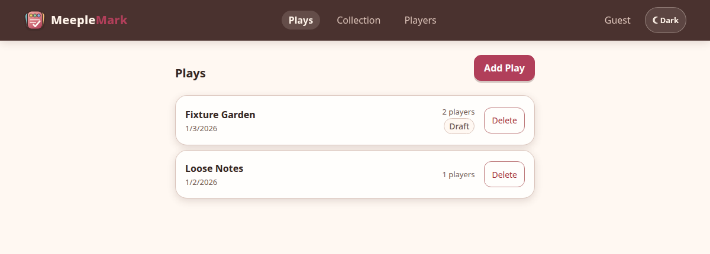
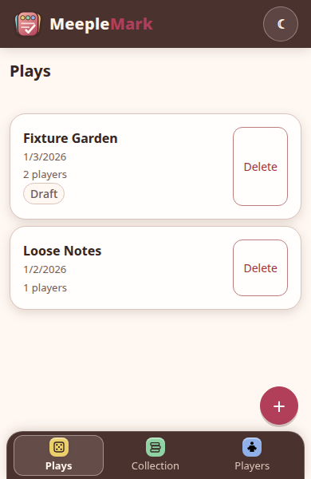

<h1> MeepleMark</h1>

MeepleMark is a local-first board-game scorepad for phones and desktops. It
records games, players, reusable score sheets, drafts, results, and play history
without requiring an account or a network connection.

This is an LLM-assisted project.

<p>
  <div>Desktop view:</div>
   
</p>
<p>
  <div>Phone view:</div>
  
</p>

## What it does

- Scores games with either one total per player or up to ten custom categories.
- Calculates exact decimal totals, rankings, and ties while preserving manual
  total and rank overrides.
- Supports ranked games and explicit win/loss results for cooperative, solo, or
  elimination-based games.
- Keeps a game collection, player directory, reusable score sheets, and
  completed-play history.
- Imports and exports individual score sheets as JSON.
- Saves locally in IndexedDB and works offline after the application shell has
  been loaded successfully.
- Optionally synchronizes account-owned data through a self-hosted
  Fastify/PostgreSQL service.

See the [user manual](docs/user-manual.md) for the scoring workflow, score-sheet
management, offline behavior, accounts, and the JSON format.

## Quickstart

Clone the repository first:

```bash
git clone https://github.com/tintii/MeepleMark-web.git
cd MeepleMark-web
```

### Local development

Requirements: Node.js 22 or later and npm.

```bash
npm install
npm run dev
```

Open `http://localhost:5173`. Continue as a guest to use the complete scoring
workflow without running the API or PostgreSQL.

### Docker Compose

Copy `.env.example` to `.env`, set `POSTGRES_PASSWORD`, `SESSION_SECRET`, and
the public HTTPS `APP_ORIGIN`, then start the database and application:

```bash
cp .env.example .env
docker compose build
docker compose run --rm migrate
docker compose up -d
```

For reverse-proxy setup, administrator provisioning, upgrades, and backups,
follow the [self-hosting guide](docs/self-hosting.md). For account-backed local
development, tests, and repository structure, see the
[development guide](docs/development.md).

## Documentation

- [User manual](docs/user-manual.md)
- [Development guide](docs/development.md)
- [Changelog](CHANGELOG.md)
- [Self-hosting, upgrades, backup, and recovery](docs/self-hosting.md)
- [Persistence and synchronization architecture](docs/self-hosted-persistence.md)
- [Golden scoring corpus](golden/README.md)

## Future plans

These are possible directions rather than scheduled commitments:

- Proper BoardGameGeek integration for finding games and importing useful game
  metadata, instead of treating BGG usernames as local text only.
- Full workspace import and export for backups and moving data between
  installations.
- Shared game catalogues and reusable score sheets without exposing private
  collections or play history.
- Optional groups and live collaborative scorekeeping.
- Synchronization with a future native iOS client.

## Project status

MeepleMark is an experimental, LLM-assisted project. Review its security
assumptions, migrations, and deployment configuration before relying on it in
production.
