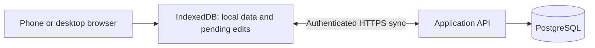

# Web-first persistence and self-hosting direction

Recorded: 2026-09-26. Updated: 2026-09-27. Status: implemented for the
`self-hosted-accounts-and-sync` change; deployment remains operator-managed.

Implementation is now specified in
[self-hosted-accounts-and-sync](../openspec/changes/self-hosted-accounts-and-sync/proposal.md),
with a [technical design](../openspec/changes/self-hosted-accounts-and-sync/design.md)
and [ordered tasks](../openspec/changes/self-hosted-accounts-and-sync/tasks.md).
The implementation uses installation-local accounts with operator-controlled public registration, retains guest scoring,
uses Fastify/PostgreSQL, exposes visible revision conflicts, and ships a
Docker/Compose deployment. All initial games remain user-scoped; a shared
catalogue is deferred.

## Direction and scope

Prioritize MeepleMark-web for phones and desktops. The product owner is leaning toward web-only delivery; permanent retirement of native iOS is not decided. The Swift implementation remains a feature/visual reference and its golden fixtures remain the scoring contract.

Self-hosting is the deployment priority. PostgreSQL is the server database.
User accounts and recorded players are separate concepts. The repository ships
Docker packaging and a documented Compose deployment; no managed hosting or
identity provider is required.

This supersedes the earlier product-wide prohibition on accounts and a backend.
It does not retroactively expand `ios-parity-responsive-web`: that completed
checklist describes the guest/local browser implementation. The application now
supports both that guest workspace and separately scoped account workspaces.

The [iOS repository impact note](../../MeepleMark/docs/web-first-direction.md) records the native roadmap implications. Cross-repository relative links assume sibling checkouts.

## Persistence responsibilities

Implemented architecture:

PostgreSQL holds accepted account-owned records. IndexedDB holds the browser's local replica and unacknowledged edits. A successful local save and server synchronization are distinct states; the UI must distinguish them. An offline completed play can be recorded locally while remaining pending sync. Reconnection must not require re-entering scores.

Keep the pure engine, exact decimal-string transport, sticky overrides, and embedded template snapshots. Relational columns suit ownership, IDs, dates, and relationships; `jsonb` suits scoring snapshots and category values. The exact schema belongs in the backend proposal. PostgreSQL supports combining relational and JSON storage, including indexed `jsonb` queries. [PostgreSQL JSON documentation](https://www.postgresql.org/docs/current/datatype-json.html)

MongoDB is not planned for this path. Browsers use the API rather than receive database credentials or connect directly to PostgreSQL.

## Users and players

| Concept | Meaning and ownership |
|---|---|
| User | Authenticated account on an installation; owns private records and access rights |
| Player | Named participant in a user's directory; requires no login |
| Play | Session owned by its recording user; embeds participant names and scoring snapshot |
| Collection membership | A user's ownership of a game, separate from shared game facts |
| Local score sheet | A user's scoring configuration, copied into a play when selected |

A user can record Alice and Bob without creating accounts for either. Two users can each have a player named Alice without merging those records. A BGG username is optional player metadata, not a MeepleMark login or proof of shared identity. Automatic player-to-account linking is outside this phase.

The API must enforce ownership from the authenticated session on reads and writes, including referenced IDs. A client-supplied `ownerId` is not authorization. Player renaming/deletion preserves historical names, scores, and snapshots; deleting an account is a separate policy decision.

If canonical game metadata is shared, collection membership and user-authored sheets remain per user. Today's local `GameRecord.ownedAt` and `localTemplate` must not become globally shared ownership/template state. Custom games remain private unless a future sharing design explicitly changes that.

## Offline synchronization and local-data migration

The implementation retains local-first entry with account-backed synchronization.
Guest use remains the no-setup path; account workspaces are optional. The first
administrator requires operator bootstrap, after which normal accounts can use
public registration when an administrator opens it.

Implemented synchronization guarantees include:

- Stable client-generated IDs, record revisions, and idempotent mutation IDs so retries cannot duplicate plays.
- Conflict detection and visible recovery for simultaneous edits; do not silently adopt last-write-wins for scores.
- Deletion markers and retention so a stale offline browser cannot recreate deleted records.
- A pending-change queue, incremental downloads, and locally saved/syncing/synced/failed/conflicted states.
- Account and installation scoping of browser data. Logout/account switching must not expose another user's cached data or upload pending edits under the wrong account.
- Session expiry and reauthentication before upload, preserving offline changes.
- Explicit adoption of existing unowned IndexedDB records, with deduplication and retry/recovery. Never assign all local records to whichever account signs in first.

Each installation has its own accounts/database. Cross-installation synchronization, shared live scoring by several users, and native iOS synchronization are outside the initial direction.

## Self-hosted Docker deployment

The supported topology is a single-host Compose deployment with an application
service serving the built frontend and API, a one-shot migration service, and
PostgreSQL on an internal network. The operator supplies HTTPS ingress; the
sample Caddy configuration is not an embedded certificate service.

The repository includes a multi-stage `Dockerfile`, `compose.yaml`,
`.env.example`, numbered migrations, and operator instructions. Compose
represents services, networks, volumes, and secrets in one deployment
definition. [Docker Compose documentation](https://docs.docker.com/compose/intro/compose-application-model/)

The delivery plan must cover:

- Production builds, versioned images, and runtime configuration for an operator-controlled domain.
- A persistent PostgreSQL volume and no publicly exposed database port by default. Volumes outlive individual containers. [Docker volume lifecycle](https://docs.docker.com/engine/storage/volumes/#a-volumes-lifecycle)
- Credentials/session secrets supplied at runtime, outside committed source and images.
- Database readiness, application health checks, and an explicit ordered migration step.
- HTTPS, same-origin API routing, correct SPA/service-worker paths, and a migration story when a hostname change changes browser storage scope.
- Tested database backup/restore, upgrade instructions, and schema-compatible rollback. A persistent volume alone is not a backup.
- Fresh-install and container-replacement smoke tests proving accounts, players, plays, templates, and memberships survive.

No hosted service, automated TLS, off-host backup destination, or monitoring
stack is bundled. Operators own their domain, proxy, secrets, backup retention,
and upgrade windows.

## Current boundaries and follow-up work

The implementation includes public username/password registration controlled by
an administrator. It deliberately excludes email recovery, OIDC, shared
catalogues, groups, live multi-user scoring, native iOS
sync, cross-installation sync, federation, and general import/export. Successful
mutation receipts, change metadata, and tombstones are retained for the life of
an account; cleanup needs a future cursor-expiry design. The initial server also
serializes mutations per user, which is appropriate for personal scoring but is
not a high-throughput collaboration design.

Operator bootstrap/assisted recovery, guest continuity, record-level conflict choices,
confirmed account deletion, and restore-epoch handling are settled for this
scope. Ingress/domain configuration and backup retention remain installation
policy. Native retirement remains undecided.

BGG integration remains separate. A backend does not authorize shipping BGG tokens in browser assets or establish a BGG authentication design.
