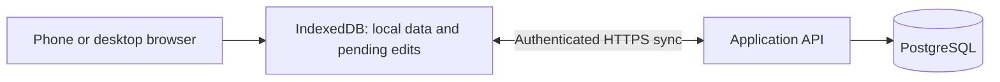

# Web-first persistence and self-hosting direction

Recorded: 2026-09-26. Status: architecture direction, not an implemented backend or an apply-ready OpenSpec change.

Implementation is now specified in
[self-hosted-accounts-and-sync](../openspec/changes/self-hosted-accounts-and-sync/proposal.md),
with a [technical design](../openspec/changes/self-hosted-accounts-and-sync/design.md)
and [ordered tasks](../openspec/changes/self-hosted-accounts-and-sync/tasks.md).
That proposal uses operator-created local accounts as its stated draft default,
retains guest scoring, selects Fastify/PostgreSQL, specifies visible revision
conflicts, and includes Docker/Compose acceptance. It keeps all initial games
user-scoped; a shared catalogue is deferred. These are proposed implementation
choices, not functionality already shipped. The open topics below describe the
earlier direction and are resolved for this scope by that proposal unless noted.

## Direction and scope

Prioritize MeepleMark-web for phones and desktops. The product owner is leaning toward web-only delivery; permanent retirement of native iOS is not decided. The Swift implementation remains a feature/visual reference and its golden fixtures remain the scoring contract.

Self-hosting is the deployment priority. PostgreSQL is the working server-database choice. User accounts and recorded players are separate concepts. The eventual server-backed release needs Docker packaging and a documented Docker Compose deployment. No managed hosting or identity provider is a required dependency of this direction.

This supersedes the earlier product-wide prohibition on accounts and a backend. It does not retroactively expand `ios-parity-responsive-web`: that completed checklist describes a local browser implementation. The current application still stores data in IndexedDB; this document introduces no backend, login, synchronization, or containers.

The [iOS repository impact note](../../MeepleMark/docs/web-first-direction.md) records the native roadmap implications. Cross-repository relative links assume sibling checkouts.

## Persistence responsibilities

Proposed architecture:

PostgreSQL holds accepted account-owned records. IndexedDB holds the browser's local replica and unacknowledged edits. A successful local save and server synchronization are distinct states; the UI must distinguish them. An offline completed play can be recorded locally while remaining pending sync. Reconnection must not require re-entering scores.

Keep the pure engine, exact decimal-string transport, sticky overrides, and embedded template snapshots. Relational columns suit ownership, IDs, dates, and relationships; `jsonb` suits scoring snapshots and category values. The exact schema belongs in the backend proposal. PostgreSQL supports combining relational and JSON storage, including indexed `jsonb` queries. [PostgreSQL JSON documentation](https://www.postgresql.org/docs/current/datatype-json.html)

MongoDB is not planned for this path. Browsers use the API rather than receive database credentials or connect directly to PostgreSQL.

## Users and players

| Concept | Meaning and ownership |
|---|---|
| User | Authenticated account on an installation; owns private records and access rights |
| Player | Named participant in a user's directory; requires no login |
| Play | Session owned by its recording user; embeds participant names and scoring snapshot |
| Collection membership | A user's ownership of a game, separate from shared game facts |
| Local score sheet | A user's scoring configuration, copied into a play when selected |

A user can record Alice and Bob without creating accounts for either. Two users can each have a player named Alice without merging those records. A BGG username is optional player metadata, not a MeepleMark login or proof of shared identity. Automatic player-to-account linking is outside this phase.

The API must enforce ownership from the authenticated session on reads and writes, including referenced IDs. A client-supplied `ownerId` is not authorization. Player renaming/deletion preserves historical names, scores, and snapshots; deleting an account is a separate policy decision.

If canonical game metadata is shared, collection membership and user-authored sheets remain per user. Today's local `GameRecord.ownedAt` and `localTemplate` must not become globally shared ownership/template state. Custom games remain private unless a future sharing design explicitly changes that.

## Offline synchronization and local-data migration

The direction retains local-first entry with account-backed synchronization. Optional guest use is the preferred continuity path for today's no-setup workflow, but the first release's guest/login policy is not decided.

Before implementation, specify:

- Stable client-generated IDs, record revisions, and idempotent mutation IDs so retries cannot duplicate plays.
- Conflict detection and visible recovery for simultaneous edits; do not silently adopt last-write-wins for scores.
- Deletion markers and retention so a stale offline browser cannot recreate deleted records.
- A pending-change queue, incremental downloads, and locally saved/syncing/synced/failed/conflicted states.
- Account and installation scoping of browser data. Logout/account switching must not expose another user's cached data or upload pending edits under the wrong account.
- Session expiry and reauthentication before upload, preserving offline changes.
- Explicit adoption of existing unowned IndexedDB records, with deduplication and retry/recovery. Never assign all local records to whichever account signs in first.

Each installation has its own accounts/database. Cross-installation synchronization, shared live scoring by several users, and native iOS synchronization are outside the initial direction.

## Self-hosted Docker deployment target

Start with a single-host Compose deployment. Logical components are HTTPS ingress, an application service serving the built frontend and API, and PostgreSQL on an internal network. The ingress may be the operator's existing reverse proxy. The server framework and exact container split remain implementation choices.

Deliver Dockerfile(s), `compose.yaml`, a non-secret example configuration, migrations, and operator instructions. Compose represents services, networks, volumes, and secrets in one deployment definition. [Docker Compose documentation](https://docs.docker.com/compose/intro/compose-application-model/)

The delivery plan must cover:

- Production builds, versioned images, and runtime configuration for an operator-controlled domain.
- A persistent PostgreSQL volume and no publicly exposed database port by default. Volumes outlive individual containers. [Docker volume lifecycle](https://docs.docker.com/engine/storage/volumes/#a-volumes-lifecycle)
- Credentials/session secrets supplied at runtime, outside committed source and images.
- Database readiness, application health checks, and an explicit ordered migration step.
- HTTPS, same-origin API routing, correct SPA/service-worker paths, and a migration story when a hostname change changes browser storage scope.
- Tested database backup/restore, upgrade instructions, and schema-compatible rollback. A persistent volume alone is not a backup.
- Fresh-install and container-replacement smoke tests proving accounts, players, plays, templates, and memberships survive.

Docker is a delivery requirement for the server-backed phase. No image is built or service deployed by this documentation update.

## Delivery sequence and open decisions

1. Propose the backend foundation: ownership model, PostgreSQL schema, API, authentication/session handling, and operator account provisioning/recovery.
2. Propose browser synchronization and adoption of existing local records, including conflicts, deletions, and account isolation.
3. Package and verify Compose deployment, migrations, backup/restore, and upgrades before calling the server-backed release self-hostable.

Develop with the Compose target in mind from the backend foundation, even if final packaging is a separate work item. Prefer one coherent backend over unnecessary distributed services.

Still open: authentication method, registration/admin provisioning and recovery, guest policy, server framework/database access layer, concrete sync conflict behaviour, account deletion/retention, and ingress/domain setup. Resolve these in the implementation proposal; none is claimed as completed here.

BGG integration remains separate. A backend does not authorize shipping BGG tokens in browser assets or establish a BGG authentication design.
