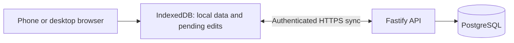

# Persistence and synchronization architecture

MeepleMark is local-first. Guest workspaces use IndexedDB only; signed-in
workspaces use IndexedDB as a local replica and synchronize account-owned data
with a Fastify API backed by PostgreSQL.

## Storage responsibilities

IndexedDB holds browser-local games, players, score sheets, plays, account
partitions, and pending mutations. PostgreSQL holds server-acknowledged records
for signed-in accounts. A local save and a successful synchronization are
separate states, shown as pending, synchronized, failed, or conflicted in the
interface.

Scores travel as decimal strings so calculations remain exact. Plays embed the
player names and score-sheet snapshot used to create them, preserving completed
records when a player or sheet changes. PostgreSQL uses relational columns for
ownership and relationships and `jsonb` for scoring snapshots and category
values.

## Ownership model

| Concept | Meaning |
|---|---|
| User | An authenticated account that owns private records on one installation. |
| Player | A named participant in a user's directory; no login is required. |
| Play | A scoring session owned by its recording user. |
| Collection membership | A user's ownership of a game. |
| Score sheet | A user's scoring configuration, copied into a play when selected. |

The API derives ownership from the authenticated session rather than trusting a
client-supplied owner ID. Browser data is partitioned by installation and
account so switching accounts cannot expose or upload another user's records.
Users and players are separate: two users can each store a player named Alice,
and a player's optional BGG username does not link that player to an account.

## Synchronization

The synchronization protocol uses stable client-generated record IDs, record
revisions, and idempotent mutation IDs. Its behavior includes:

- an offline outbox that retries changes without duplicating plays;
- incremental downloads and deletion markers;
- visible conflict resolution instead of silent last-write-wins for scores;
- reauthentication after session expiry without discarding pending work;
- explicit adoption of guest records into an account workspace; and
- a recovery epoch that prevents offline changes from being replayed blindly
  after a database restore.

Successful mutation receipts, change metadata, and tombstones remain for the
life of an account. Mutations are serialized per user, which suits personal
scorekeeping rather than high-throughput collaboration.

## Accounts and administration

Accounts use normalized usernames, Argon2id password hashes, opaque cookie
sessions, origin checks, and request limits. Roles are `admin`, `user`, and
`readonly`. Read-only accounts can view synchronized data but cannot upload
mutations, guest adoption, or conflict choices.

Public registration is controlled by an administrator and is closed by
default. It never creates an administrator. The `/admin` interface manages
registration policy, account roles and status, session revocation, recovery,
confirmed account deletion, and audit events. The last enabled administrator
with an initialized password cannot be demoted, disabled, or deleted.

## Deployment boundary

The supported account-backed topology is one application service and one
PostgreSQL 17 database on a single Docker Compose host. PostgreSQL is private to
the Compose network, migrations run as a one-shot service, and the operator
provides same-origin HTTPS, secrets, monitoring, and backups.

MeepleMark does not support email recovery, OIDC, shared catalogues, groups,
live multi-user scoring, cross-installation synchronization, federation, or
native iOS synchronization. Browser caches are not encrypted from someone who
controls the browser profile.

See the [self-hosting guide](self-hosting.md) for installation, upgrades,
backups, recovery, and account operations.
