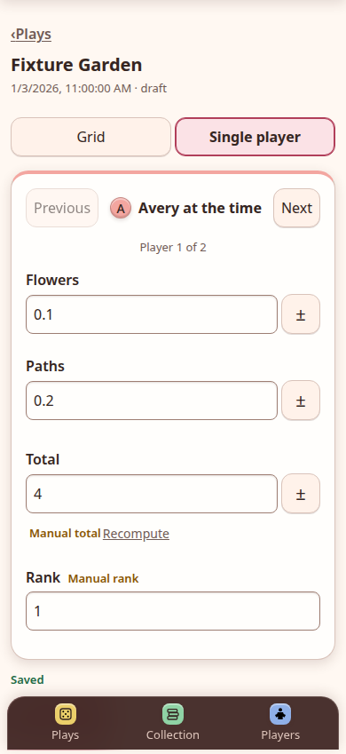
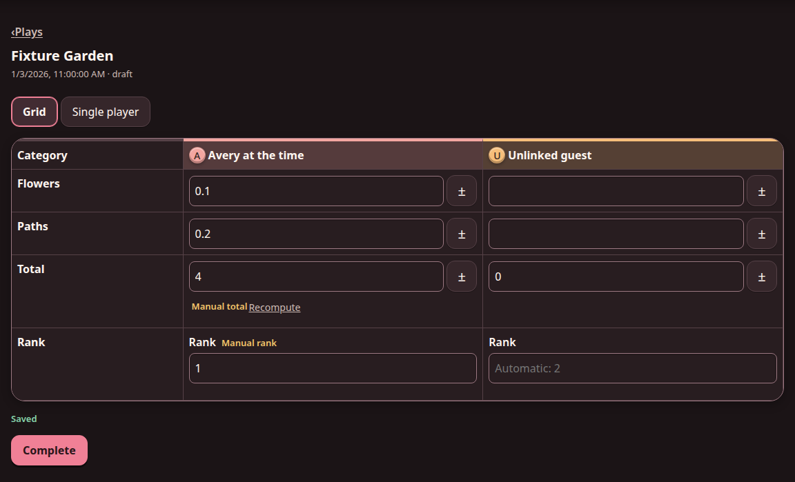

# MeepleMark user manual

## Getting started

Open MeepleMark and continue as a guest to begin immediately. Guest data stays
in this browser. The main areas are:

- **Plays** — start a game, resume drafts, and review or delete history.
- **Collection** — manage games and their reusable score sheets.
- **Players** — save frequently used player names and optional metadata.
- **Account** — sign in, synchronize, and review synchronization status.

<p>
  
  
</p>

## Recording a play

1. Select **Add Play**.
2. Enter or select a game and at least one player.
3. Choose the win direction and result type. If the game has a saved score
   sheet, select **Use score sheet** to use its categories and rules.
4. Select **Start play**, enter scores, and select **Complete** when finished.

Drafts remain editable. Ranked games calculate ranks automatically, including
ties. Win/loss games show an explicit outcome for each player. In a category
score sheet, totals update as values are entered; typing a total manually makes
it an override until **Recompute** is selected.

### Phone scorepad

On phones, **Single player** keeps one player's categories and controls within
easy reach. Use **Previous** and **Next** to move between players.



### Desktop scorepad

On wider screens, **Grid** shows every player and category together. The layout
can be changed at any time without losing partially entered scores.



## Games and score sheets

Add games from **Collection**. A game can have one saved score sheet containing
one to ten ordered categories, a high- or low-score win direction, and either
ranked or win/loss outcomes.

From a game's page:

- Select **Add a score sheet** or **Edit score sheet** to change its categories
  and rules.
- Use **Move up** and **Move down** to reorder categories.
- Select **Export score sheet** to download the saved sheet as JSON.
- In the editor, select **Choose file** to import JSON. Import fills the form for
  review; select **Save** to apply it to the current game.

Changing or deleting a game's sheet never rewrites an existing play. Each play
keeps the score-sheet snapshot with which it was created.

## Score-sheet JSON format

An exported file contains one JSON object:

```json
{
  "slug": "terraforming-mars",
  "version": 1,
  "winDirection": "high",
  "defaultOutcome": "ranked",
  "categories": [
    { "key": "terraform-rating", "label": "Terraform Rating" },
    { "key": "awards", "label": "Awards" }
  ]
}
```

| Field | Format |
|---|---|
| `slug` | Non-empty string identifying the source sheet. |
| `version` | Integer of 1 or greater. |
| `winDirection` | `"high"` or `"low"`. |
| `defaultOutcome` | `"ranked"` or `"flagged"`; `flagged` means explicit win/loss. |
| `categories` | Ordered array of 1–10 category objects. |
| `categories[].key` | Unique, non-empty machine-readable string. |
| `categories[].label` | Non-empty label shown to the user. |

The format is strict: unknown fields, duplicate category keys, invalid values,
or files larger than 64 KiB are rejected. Import transfers category labels and
rules. When saved, MeepleMark assigns the destination game's local slug and
version, rather than trusting those values from the imported file.

## Players and history

The player directory avoids retyping regular players. Renaming or deleting a
saved player does not change names recorded in older plays. The **Plays** screen
lists drafts and completed games most-recent-first; deleting a play does not
delete its game, players, or score sheet.

## Offline use and accounts

MeepleMark saves changes on the device first. After the application has loaded
successfully once, guest scoring and previously loaded account workspaces remain
usable offline.

An account is optional and belongs to one self-hosted installation. When signed
in, the Account screen distinguishes local saves from pending, synchronized, or
conflicted changes. If a conflict is reported, open **Review conflicts** and
choose the local or server version. Do not clear browser storage before pending
changes have synchronized.
